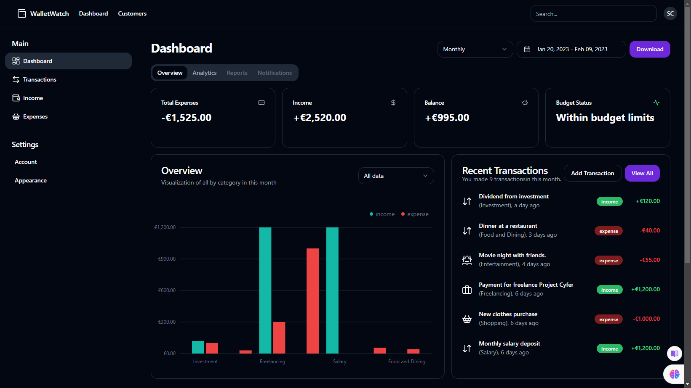
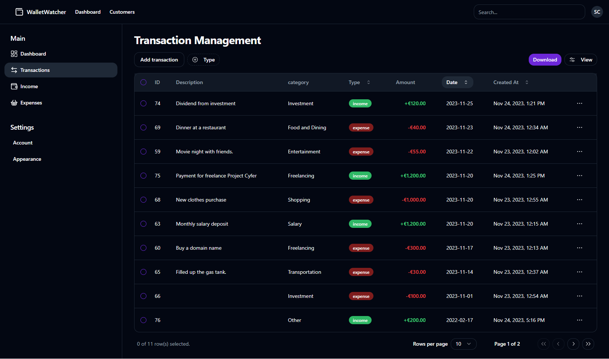
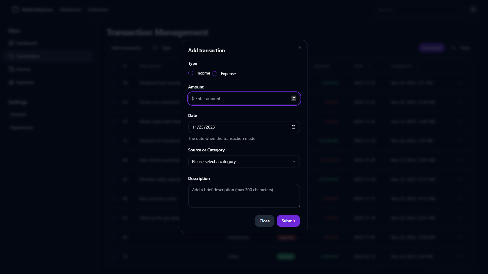
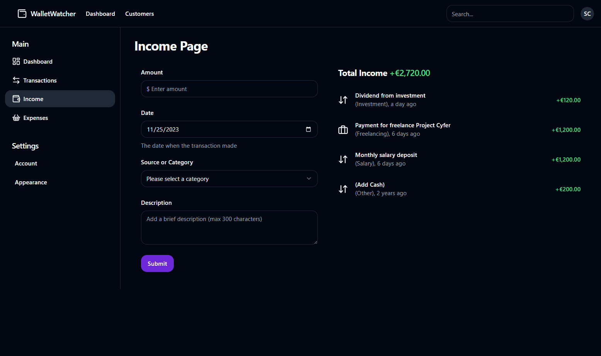
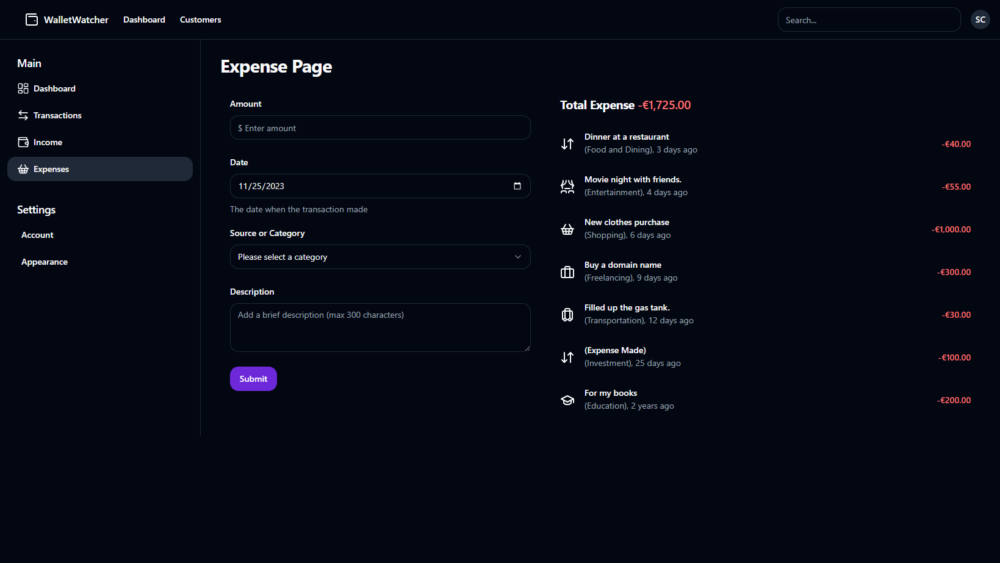
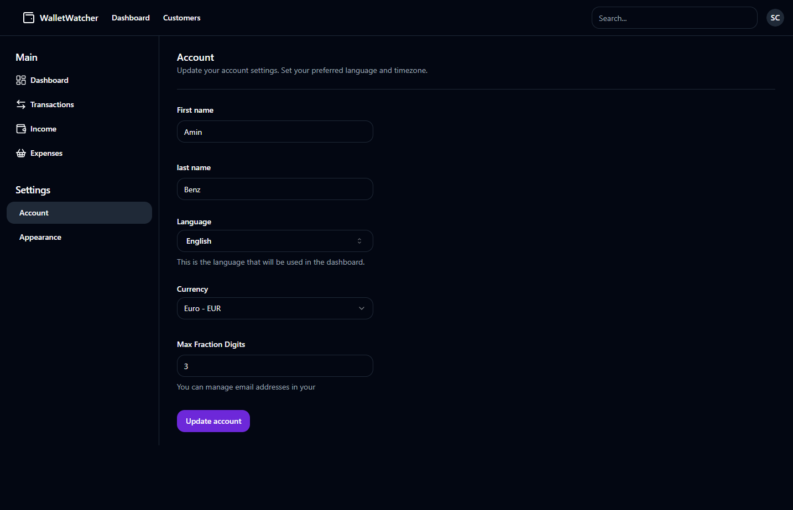
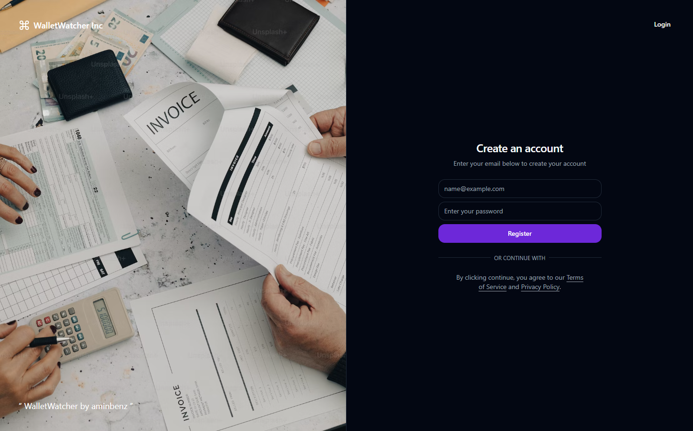

# WalletWatcher Expense Tracker App

## Overview

**WalletWatcher** is a sophisticated **expense tracker** blending modern Vite (React), Tailwind CSS, and Shadcn for the front end, paired with a robust Flask backend using PostgreSQL and SQLAlchemy. It's designed to simplify financial management with an intuitive interface, insightful visualizations, and customizable features. Monitor, analyze, and manage expenses effortlessly, empowering users to make informed financial decisions.


[Demo Video](https://youtu.be/KsDQ_fLLxsw)

## Features

### User Authentication

- **Registration/Login/Logout**: Users can register and log in securely using their email and password with Flask session management for authentication.

### Dashboard

- **Detailed Financial Overview**: Offers in-depth insights into expenses, income, balance, and budget status across both monthly and yearly periods.
- **Recent Transactions**: Displays recent transactions with details such as category, date, type (income/expense), and amount.
- **Interactive Visual Representations**: Utilizes interactive charts for clear and intuitive depictions of income and expense trends.
- **Category Comparison**: Includes a bar chart to compare spending by income and expense categories. Provides selection options for income/expense/all categories.

### Transaction Management

- Offers a detailed table view of transactions with sorting, filtering, and action functionalities (view, edit, delete).
- Simplifies the addition of new transactions through a user-friendly modal.
- Users can download their transaction data in CSV format for record-keeping and further analysis.

### Income and Expense Management

- Provides separate sections for managing income and expenses effectively.

### Account Settings

- **Profile Management**: Users have the flexibility to modify personal details such as first name, last name, date of birth, language preferences, currency settings, and maximum fraction digits.
- **Customizable Appearance**: The app allows users to personalize the appearance, including choosing different font themes and color schemes.

### Additional Features

- Tools for comparing monthly and yearly expense and income trends.
- Capability to print financial data for record-keeping purposes.
- Budget Planner (Potential Future Feature): Incorporate a tool to set and track budgets for various expense categories. Receive alerts when nearing or exceeding budget limits.
- Goal Tracking (Potential Future Feature): Set and monitor financial goals within the dashboard. Track progress visually and receive notifications upon goal completion.

## Screenshots

### Dashboard Overview



_Description: This screenshot shows the detailed overview of expenses, income, balance, and budget status displayed on both monthly and yearly scales._

### Transaction Management



_Description: This screenshot displays the table view of transactions with sorting, filtering, and action functionalities for better management._

### Add Transaction Modal



_Description: Here's an image illustrating the modal for adding new transactions, providing a user-friendly interface for inputting transaction details._

### Income Page


_Description: Here's an image illustrating the income management section, showcasing tools and functionalities related to managing income sources._

### Expenses Page


_Description: This screenshot highlights the features and layout of the expenses management section, displaying tools for managing and categorizing expenses._

### Account Settings



_Description: This screenshot illustrates the account settings page allowing users to personalize their information and customize app appearance._

### Authentication - Register/Login



_Description: This screenshot showcases the authentication interface for registering and logging into the app, ensuring secure access for users._

## Technologies Used

### Frontend

- Vite (React)
- Tailwind CSS
- Radix UI

### Backend

- Flask
- PostgreSQL
- SQLAlchemy

## Setup

1. Clone the repository:

   ```bash
   git clone https://github.com/aminbenz/walletwatcher.git
   cd walletwatcher
   ```

2. Set up the backend:

   ```bash
   cd server
   pip install -r requirements.txt
   # Configure the database in server/config.py
   py run.py
   ```

3. Set up the frontend:

   ```bash
   cd client
   npm install
   npm run dev
   ```

## Usage

1. Register or log in using your credentials.
2. Explore the /dashboard for financial insights, trends, and recent transactions.
3. Manage transactions, income, and expenses separately as needed.
